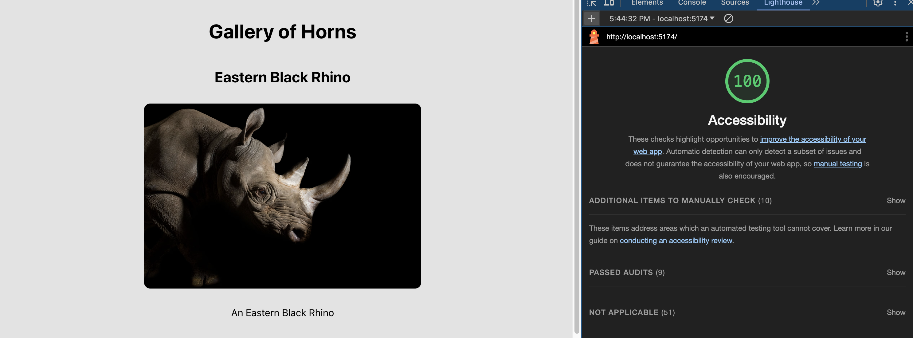
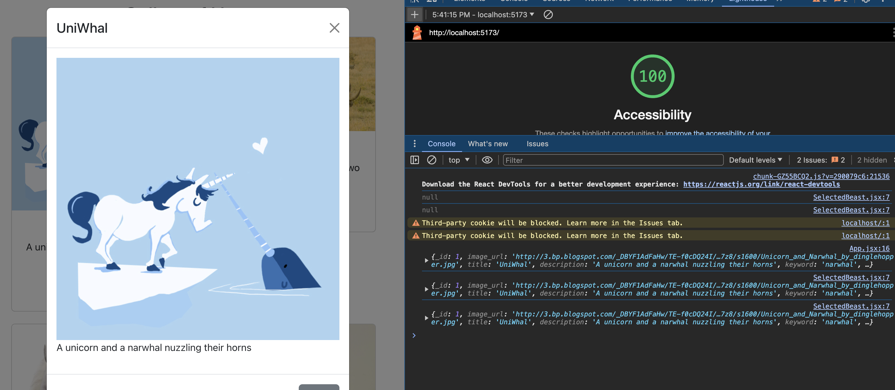

# React + Vite

This template provides a minimal setup to get React working in Vite with HMR and some ESLint rules.

Currently, two official plugins are available:

- [@vitejs/plugin-react](https://github.com/vitejs/vite-plugin-react/blob/main/packages/plugin-react/README.md) uses [Babel](https://babeljs.io/) for Fast Refresh
- [@vitejs/plugin-react-swc](https://github.com/vitejs/vite-plugin-react-swc) uses [SWC](https://swc.rs/) for Fast Refresh

# Lab001

### Lighthouse Score Lab001

# Lab002

Feature #1: Display Images:

Estimate of time needed to complete: 10 minutes (was able to complete the function in the prior lab001)
Start time: 4:30 pm EST

Finish time: 4:35pm EST

Actual time needed to complete: 5 minutes

---
Feature #2: Allow Users to Favorite Individual Beasts

Estimate of time needed to complete: 45 minutes
Start time: 4:41pm EST

Finish time: 5:18
Actual time needed to complete: 37 minutes

---

Feature #3: Bootstrap

Estimate of time needed to complete: 35 minutes
Start time: 5:20pm EST
Finish time: 5:45pm EST

Actual time needed to complete: 25 minutes

### Lighthouse Score Lab002

# Lab003

Feature #1: Display a Modal

Estimate of time needed to complete: 2 hours
Start time: 4:20 pm EST

Finish time: 5:40 pm EST 

Actual time needed to complete: 1 hour 20 minutes

### Lighthouse Score Lab003
